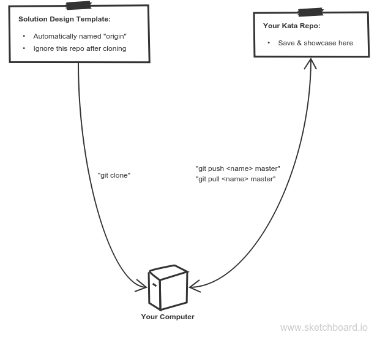

# using starter repos

1. Clone the template into a new directory on your computer.
2. Customize the directory for your exercise:
    * Rename the directory
    * Re-title the README
    * ...
3. Create a new repo on your GH account 
    * _Do not initialize with a README_
    * Name it after the exercise you are completing
4. Add the new repo as a remote from your terminal ("git remote add ...")
5. Git push to your new repo
6. Update your github repository:
    * Change the gh-pages settings to build from master
    * Add a link to your live tests in the repo description
7. Add links to the repository and live demo in your /index repo.
8. Work on the challenge from your local text editor, running tests from the browser with "index.html". 
9. Save your work by pushing to your GitHub account

___

## GitHub Work-Flow Diagram

___

## Resources

* [Cloning a Repo](https://help.github.com/articles/cloning-a-repository/)
* [Adding Remote Repos](https://help.github.com/articles/adding-a-remote/)

___
___
### 